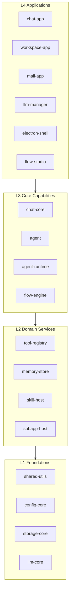

# XingSeq

> A layered Agent Harness framework for building, running, and orchestrating LLM agents. ReAct loop, tool registry, multi-provider LLM support, workspace isolation, and safety confirmation out of the box.

[中文简介](#简介)

---

## Highlights

- **ReAct loop**: streaming chat session with tool-call planning, execution, and observation.
- **Tool registry**: builtin tool groups (`workspace`, `fs`, `shell`, `web`, `email`) plus plugin loading.
- **Multi-provider LLM clients**: DeepSeek, Kimi, Qwen, Doubao, with a unified streaming/error handling layer.
- **Workspace isolation**: per-workspace storage, path sandboxing, and memory separation.
- **Safety confirmation**: four-layer guard for destructive fs/shell operations before execution.
- **Mail gateway**: IMAP polling + SMTP auto-reply, integrated with the chat engine.
- **HTTP + SSE server + Vite React frontend** for chat-app and workspace-app.
- **Monorepo**: npm workspaces + Makefile, layered dependency constraints (L4 apps → L3 cores → L2 domains → L1 bases).

---

## Architecture

```text
L4 Applications    chat-app · workspace-app · mail-app · llm-manager
                          · electron-shell · flow-studio · chatroom-app · hello-chat
                          ↑
L3 Core Capabilities      chat-core (ready) · agent · agent-runtime · flow-engine
                          ↑
L2 Domain Services        tool-registry · memory-store · skill-host · subapp-host
                          ↑
L1 Foundations            shared-utils · config-core · storage-core · llm-core
```



Dependency rule: upper layers may only import lower layers; same-layer modules do not depend on each other.

---

## Quick Start

```bash
# 1. Clone
git clone git@github.com:xingseq/xingseq.git
cd xingseq

# 2. Install dependencies for all workspaces
npm install

# 3. Verify without an API key (mock LLM + tool loop)
make chat-dry

# 4. Configure at least one LLM API key for live mode
cp .env.example .env
# Edit .env and set DEEPSEEK_API_KEY (or KIMI_API_KEY / QWEN_API_KEY / DOUBAO_API_KEY)

# 5. Run the interactive CLI with a real LLM
make chat
```

Other useful commands:

```bash
make chat-dry       # dry-run mode, no real LLM calls
make chat-list      # list available tools
make server         # start HTTP+SSE backend on :3001
make web-dev        # start backend + Vite frontend
make ws             # start workspace-app CLI
make mail-dry       # start mail gateway in offline dry mode
make test           # run smoke test
```

See `Makefile` for the full command list.

---

## Background

XingSeq started as a single-file Electron + React desktop assistant (2000+ files, 200+ modules, all tightly coupled). As the project grew — adding multi-provider LLM support, workspace sandboxing, a mail gateway, and tool orchestration — the monolith became unmaintainable.

The refactoring strategy:
1. **Extract layer by layer** — start from the lowest-level utilities (L1), prove them in isolation, then migrate domain services (L2) and core capabilities (L3) on top.
2. **Migrate on demand** — only pull code into the new monorepo when an upper-layer app actually needs it. No big-bang copy.
3. **Validate at each step** — each layer has a dry-run mode to verify integration without real API keys or network.

The result is the current four-layer architecture with clear dependency constraints and per-workspace isolation.

---

## Project Status

| Layer | Status | Notes |
|---|---|---|
| L1 Foundations | Migrated | shared-utils, config-core, storage-core, llm-core |
| L2 Domain Services | Ready | tool-registry, memory-store |
| L3 Core Capabilities | In Progress | chat-core ready; agent, agent-runtime, flow-engine scaffolded |
| L4 Applications | 3 Ready | chat-app, workspace-app, mail-app ready; others scaffold/dev |

---

## Ecosystem

- **XingSeq** (this repo): the Agent Harness framework itself — runtime, tool system, and multi-provider LLM orchestration.
- **cmdseal**: system-level security isolation and sandboxing for dangerous operations.
- **AgentPost**: mobile/web interaction layer for end users.

---

## License

MIT — see [LICENSE](./LICENSE).

---

## 简介

**星序引擎（XingSeq）** 是一个分层架构的 Agent Harness 框架，用于构建、运行和编排大语言模型智能体。内置 ReAct 对话循环、工具注册与派发、多提供商 LLM 客户端、工作区隔离和安全确认机制。

### 从单体到分层

星序引擎前身是一个 2000+ 文件的 Electron + React 桌面助手单体项目。随着功能膨胀（多模型适配、工作区沙箱、邮件网关、工具编排），单体架构已无法维护。

重构策略：从最底层工具库（L1）开始逐层抽离，每一层独立验证后再向上迁移，按需拉入代码而非一次性复制。最终形成当前四层架构，层间依赖单向约束，每个工作区完全隔离。

核心设计：

- **L1 基座**：shared-utils、config-core、storage-core、llm-core
- **L2 领域**：tool-registry、memory-store、skill-host、subapp-host
- **L3 能力**：chat-core（已落地）、agent、agent-runtime、flow-engine
- **L4 应用**：chat-app、workspace-app、mail-app 已可用，其余正在迁移

本项目由原单体项目（2000+ 文件）按层拆分而来，采用按需迁入策略，不一次性复制全部代码。

快速开始：

```bash
git clone git@github.com:xingseq/xingseq.git
cd xingseq
npm install
make chat-dry                   # 无需 API Key，先验证 mock 对话循环
cp .env.example .env            # 编辑 .env 填入 DEEPSEEK_API_KEY 等 LLM API Key
make chat                       # 真实 LLM 交互模式
```

详细命令请查看 `Makefile`。
