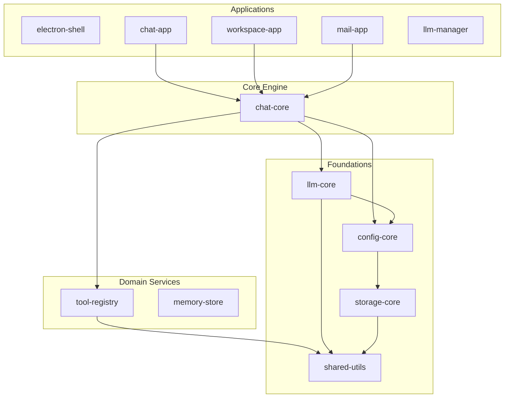

# XingSeq

[](https://github.com/xingseq/xingseq/actions/workflows/ci.yml)
[](./LICENSE)
[](https://nodejs.org/)

**XingSeq** is an Agent Harness framework — it handles the *runtime plumbing* so you can focus on what your agent actually does.

You define tools. XingSeq handles the ReAct loop, streams tokens from any LLM provider, dispatches tool calls through a registry, enforces safety confirmation before destructive operations, and persists conversations per workspace. All in plain Node.js, no Python, no heavy abstractions.

> **TL;DR** — Clone, `npm install`, `make chat-dry`. You'll see a full tool-calling loop running locally with zero API keys.

[中文](./README_zh.md)

---

## Why XingSeq?

Most agent frameworks give you one of two things: a thin wrapper around chat completions, or a sprawling platform with its own DSL, database, and deployment story.

XingSeq sits in between:

- **You own the process.** It's a Node.js library, not a platform. No servers to deploy, no SDK lock-in.
- **Tools are first-class.** Register tool groups with their executors; the framework handles dispatch, argument validation, and four-layer safety guards.
- **Workspace isolation.** Each workspace gets its own tool scope, conversation history, and storage — no global state leaking between sessions.
- **Multi-provider out of the box.** DeepSeek, Kimi (Moonshot), Qwen, Doubao — unified streaming, error handling, and session control.
- **Runs without API keys.** Every app has a `dry-run` mode with a mock LLM, so you can validate your tool wiring without burning tokens.

---

## Quick Start

```bash
git clone git@github.com:xingseq/xingseq.git
cd xingseq
npm install

# Verify the full tool-calling loop — no API key needed
make chat-dry
```

To talk to a real LLM:

```bash
cp .env.example .env
# Set at least one: DEEPSEEK_API_KEY / KIMI_API_KEY / QWEN_API_KEY / DOUBAO_API_KEY
make chat
```

### Other Commands

| Command | What it does |
|---------|-------------|
| `make chat-dry` | Dry-run: mock LLM + real tool dispatch |
| `make chat` | Interactive CLI with real LLM |
| `make web-dev` | HTTP+SSE backend (:3001) + Vite React frontend (:5173) |
| `make ws` | Workspace-app CLI (file/shell tools scoped to a directory) |
| `make mail-dry` | Mail gateway in offline mode |
| `make electron-build` | Build console + all sub-app frontends, then launch Electron console |
| `make test` | Smoke test |

Run `make` to see the full list.

---

## Architecture



**Dependency rule:** upper layers import lower layers only. Same-layer packages never import each other.

### Layer Responsibilities

| Layer | Packages | Role |
|-------|----------|------|
| **L1 Foundations** | `shared-utils` · `config-core` · `storage-core` · `llm-core` | Logger, config, encrypted storage, multi-provider LLM client |
| **L2 Domain** | `tool-registry` · `memory-store` · `skill-host` · `subapp-host` | Tool dispatch, conversation persistence, plugin management |
| **L3 Engine** | `chat-core` · `agent` · `flow-engine` · `agent-runtime` | ReAct loop, workspace session, safety guards |
| **L4 Apps** | `electron-shell` · `chat-app` · `workspace-app` · `mail-app` · `llm-manager` · ... | End-user applications built on the stack |

---

## How It Works

A single chat turn:

```
User message
    → chatLoop.js (depth 0)
        → LLM returns tool_calls
        → registry.dispatch(toolCall)
            → safety confirmation (if destructive)
            → executor runs, returns result
        → tool result appended to messages
    → chatLoop.js (depth 1)
        → LLM returns final text
    → response streamed to user
```

The loop continues until the LLM stops requesting tools or hits `maxDepth` (default 5).

### Tool Safety — Four Layers

1. **Path sandboxing** — all file operations confined to `workspace.filesDir`
2. **Command allowlist** — only pre-approved shell commands pass
3. **Argument filtering** — dangerous flags (`--force`, `rm -rf /`) are rejected
4. **User confirmation** — destructive ops require explicit approval (CLI prompt / Web dialog)

---

## Background

XingSeq was extracted from a 2000+ file Electron desktop assistant. The original monolith worked, but changes in one area broke three others — no clear boundaries, shared mutable state everywhere.

The rewrite strategy was simple:
1. Start from the bottom (L1) — pure utilities with zero coupling
2. Migrate code only when a real app needs it — no speculative extraction
3. Validate each layer in isolation with dry-run mode before stacking the next

The result: 12 packages with enforced single-direction dependencies, running the same features with half the complexity.

---

## Project Status

| Layer | Status |
|-------|--------|
| L1 Foundations | Stable — all 4 packages migrated and tested |
| L2 Domain | Stable — tool-registry and memory-store in production use |
| L3 Engine | chat-core stable; agent / flow-engine / agent-runtime scaffolded |
| L4 Apps | electron-shell console (multi-app host), chat-app, workspace-app, mail-app fully functional; llm-manager functional; others in dev |

> This is an active project. APIs may change between minor versions until 1.0.

---

## Contributing

See [CONTRIBUTING.md](./CONTRIBUTING.md) for setup instructions, commit conventions, and code standards.

---

## License

[MIT](./LICENSE)
