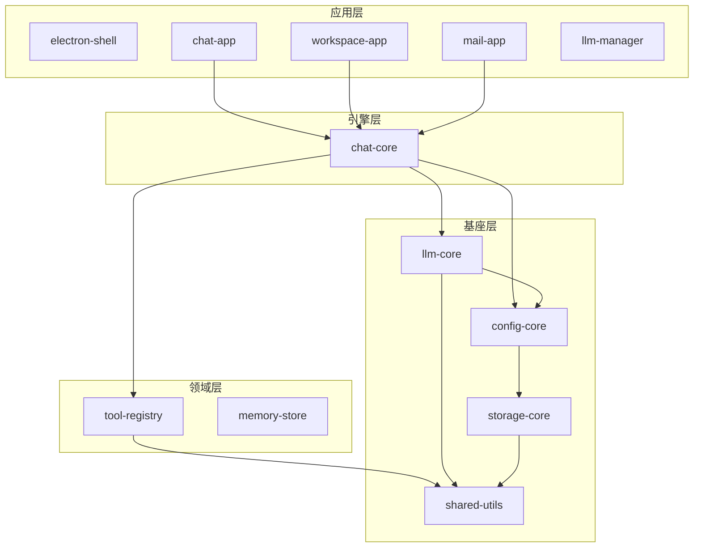

# 星序引擎 (XingSeq)

[](https://github.com/xingseq/xingseq/actions/workflows/ci.yml)
[](./LICENSE)
[](https://nodejs.org/)

[English](./README.md)

**星序引擎**是一个 Agent 运行时框架——你负责定义工具，框架负责其余一切：ReAct 循环、流式 LLM 调用、工具派发、安全确认、工作区隔离、对话持久化。

纯 Node.js，无 Python 依赖，无平台锁定。

> **一句话体验：** `git clone` → `npm install` → `make chat-dry`，零 API Key 跑通完整工具调用链路。

---

## 为什么选星序引擎？

市面上的 Agent 框架通常走两个极端：要么只是对 Chat Completions 的薄封装，要么是带 DSL、数据库、部署平台的重型方案。

星序引擎取中间路线：

- **你掌控进程。** 它是一个 Node.js 库，不是平台。没有需要部署的服务，没有 SDK 锁定。
- **工具是一等公民。** 注册工具组和执行器，框架处理派发、参数校验和四层安全防护。
- **工作区隔离。** 每个工作区拥有独立的工具作用域、对话历史和存储——会话之间零状态泄漏。
- **多模型开箱即用。** DeepSeek、Kimi（月之暗面）、Qwen（通义千问）、Doubao（豆包）——统一的流式处理与错误处理。
- **无需 API Key 即可运行。** 每个应用都有 `dry-run` 模式，用 mock LLM 验证工具接线，不烧 token。

---

## 快速开始

```bash
git clone git@github.com:xingseq/xingseq.git
cd xingseq
npm install

# 验证完整工具调用循环（无需 API Key）
make chat-dry
```

使用真实 LLM：

```bash
cp .env.example .env
# 至少设置一个：DEEPSEEK_API_KEY / KIMI_API_KEY / QWEN_API_KEY / DOUBAO_API_KEY
make chat
```

### 常用命令

| 命令 | 说明 |
|------|------|
| `make chat-dry` | 干跑模式：mock LLM + 真实工具派发 |
| `make chat` | 真实 LLM 交互式 CLI |
| `make web-dev` | HTTP+SSE 后端 (:3001) + Vite React 前端 (:5173) |
| `make ws` | 工作区助手 CLI（文件/Shell 工具锁定到指定目录） |
| `make mail-dry` | 邮件网关离线模式 |
| `make electron-build` | 构建控制台 + 各子应用前端，启动 Electron 综合控制台 |
| `make test` | 烟雾测试 |

执行 `make` 查看完整命令列表。

---

## 架构



**依赖铁规：** 上层只能引用下层，同层包之间互不依赖。

### 各层职责

| 层 | 包 | 职责 |
|----|-----|------|
| **L1 基座** | `shared-utils` · `config-core` · `storage-core` · `llm-core` | 日志、配置、加密存储、多模型 LLM 客户端 |
| **L2 领域** | `tool-registry` · `memory-store` · `skill-host` · `subapp-host` | 工具派发、对话持久化、插件管理 |
| **L3 引擎** | `chat-core` · `agent` · `flow-engine` · `agent-runtime` | ReAct 循环、工作区会话、安全防护 |
| **L4 应用** | `electron-shell` · `chat-app` · `workspace-app` · `mail-app` · `llm-manager` · ... | 基于框架构建的终端用户应用 |

---

## 工作原理

一次对话轮次的完整流程：

```
用户消息
    → chatLoop.js (depth 0)
        → LLM 返回 tool_calls
        → registry.dispatch(toolCall)
            → 安全确认（如果是破坏性操作）
            → 执行器运行，返回结果
        → tool result 追加到 messages
    → chatLoop.js (depth 1)
        → LLM 返回最终文本
    → 流式响应返回给用户
```

循环持续直到 LLM 不再请求工具调用，或达到 `maxDepth`（默认 5）。

### 工具安全——四层防护

1. **路径沙箱** — 所有文件操作限制在 `workspace.filesDir` 内
2. **命令白名单** — 只有预审批的 Shell 命令可以通过
3. **参数过滤** — 危险标志（`--force`、`rm -rf /`）被拒绝
4. **用户确认** — 破坏性操作需要显式批准（CLI 提示 / Web 弹窗）

---

## 项目背景

星序引擎的前身是一个 2000+ 文件的 Electron 桌面助手。原始单体项目能跑，但改一处坏三处——没有清晰边界，到处是共享可变状态。

重构策略：
1. 从最底层开始（L1）——纯工具函数，零耦合
2. 按需迁入——只有上层应用真正需要时才拉入代码，不做投机性抽取
3. 逐层验证——每层用 dry-run 模式验证集成后，再堆叠下一层

结果：12 个包，严格单向依赖，以一半的复杂度运行同样的功能。

---

## 项目状态

| 层 | 状态 |
|----|------|
| L1 基座 | 稳定 — 4 个包全部迁移并测试通过 |
| L2 领域 | 稳定 — tool-registry 和 memory-store 已投入使用 |
| L3 引擎 | chat-core 稳定；agent / flow-engine / agent-runtime 已搭建脚手架 |
| L4 应用 | electron-shell 控制台（多子应用宿主）、chat-app、workspace-app、mail-app 完整可用；llm-manager 可用；其余开发中 |

> 活跃开发中。1.0 之前的小版本可能存在 API 变更。

---

## 参与贡献

详见 [CONTRIBUTING.md](./CONTRIBUTING.md)。

---

## 许可证

[MIT](./LICENSE)
